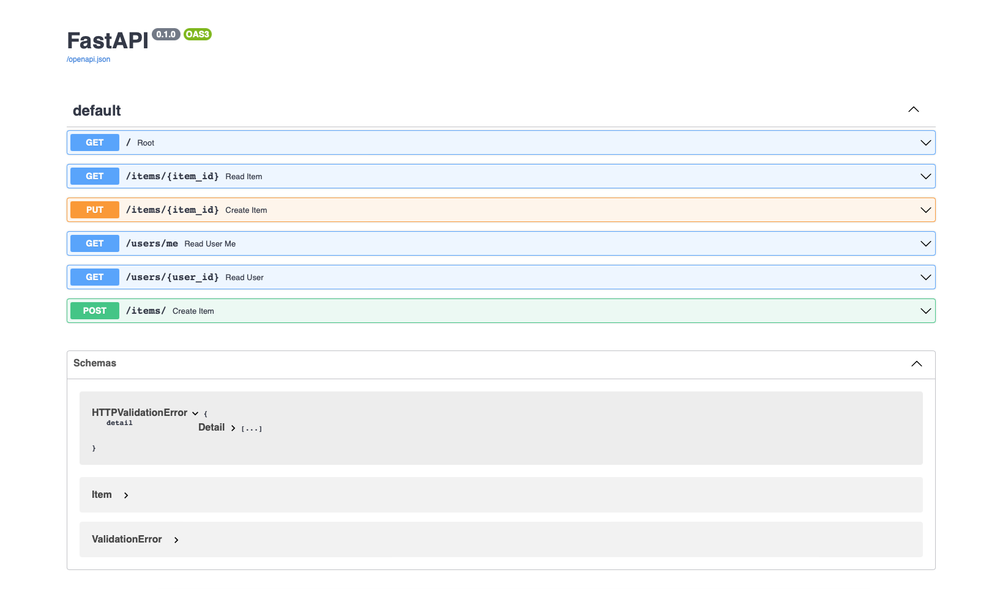
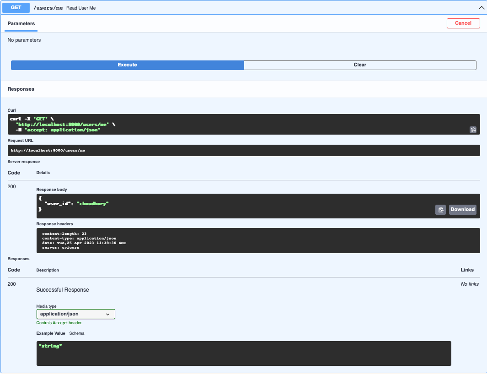

<h2 align="center">
  My first FASTAPI - v1.0 
</h2>

 &nbsp;
 &nbsp;
 &nbsp;
 &nbsp;

You can fork this repo to modify and make changes of your own. Please give me proper credit by linking back to [abhishek0412](https://github.com/abhishek0412/myFastAPI). Thanks!

## Built With

My personal portfolio <a href="https://github.com/abhishek0412/myFastAPI" target="_blank">Abhishek Choudhary</a> which features some of my github projects as well as my resume and technical skills. 

This project was built using these technologies.

- Python
- FAST API
- unicorn
- VsCode

## Features

**Prepare your first fastapi web api**

**create GET/PUT/POST call**

**Host the web API using unicorn**

## Getting Started

Clone down this repository. You will need `python` and `git` installed globally on your machine.

## 🛠 Installation and Setup Instructions

1. Installation: `python -m pip install fastapi uvicorn[standard]`

2. In the project directory, you can run: `python3 -m uvicorn main:app --reload`

Runs the app in the development mode.\
Open [http://localhost:8000](http://localhost:8000) to view it in the browser.
The page will reload if you make edits.

# Home page for FAST API Documentation
 

# Get call for FAST API Dcocumentation

### Show your support

Give a ⭐ if you like this website!

